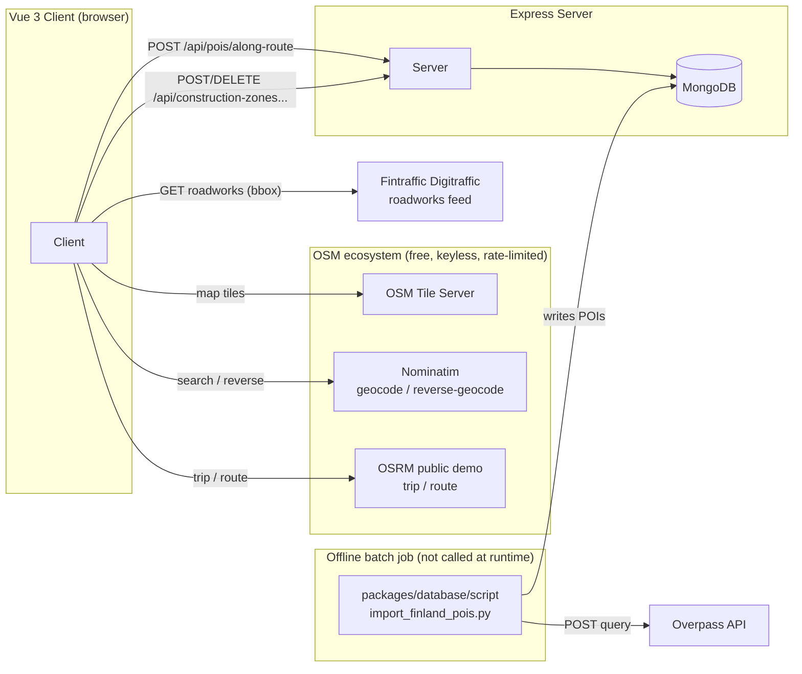
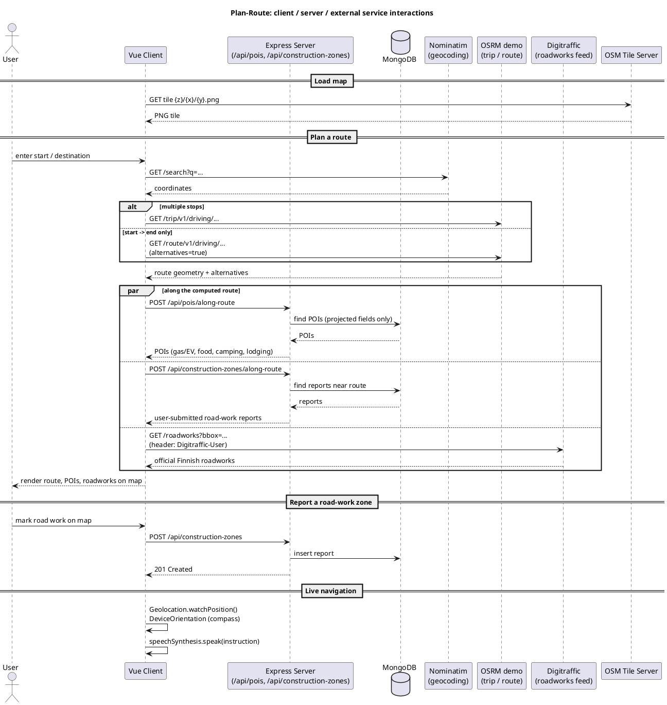

# Architecture: client, server, and external service interactions

How `packages/client` (Vue 3), `packages/server` (Express API), and the outside
world talk to each other. There are two independent networks of dependency
here — the app's own client/server API, and a set of free/keyless public OSM
services the **browser calls directly**. The Express server has no outbound
internet dependency at all.

## Sequence diagram (PlantUML)

The flowchart above shows *which* systems talk to each other; this shows the
*order* of calls for the app's two main flows — planning a route, and
reporting a road-work zone.

## 1. Client → Server (this app's own API)

Dev-time requests hit relative `/api/...` paths; Vite proxies them to
`http://localhost:3000` ([`packages/client/vite.config.ts`](../packages/client/vite.config.ts)).
Base paths are typed constants in
[`packages/client/src/constants/api.constants.ts`](../packages/client/src/constants/api.constants.ts).
The server mounts routers at `/api/pois` and `/api/construction-zones`
([`packages/server/src/index.ts:22-23`](../packages/server/src/index.ts)).

### Points of interest

| Method | Path | Purpose | Client caller | Server handler |
|---|---|---|---|---|
| POST | `/api/pois/along-route` | Fetch POIs (gas/EV, restaurants, camping, accommodation) near a route corridor | [`api/poi.api.ts`](../packages/client/src/api/poi.api.ts) `fetchPoisAlongRoute`, called from `MapView.vue` | [`routes/poi.routes.ts`](../packages/server/src/routes/poi.routes.ts) → [`controllers/poi.controller.ts`](../packages/server/src/controllers/poi.controller.ts) `listPoisAlongRouteHandler` |

`poi.routes.ts` also defines `GET /viewport`, `GET /nearby`, `GET /:id`,
`GET /`, `POST /`, `PATCH /:id`, `DELETE /:id`, but no client code calls them —
worth a look as possible dead API surface.

### Construction zone (road work) reports

| Method | Path | Purpose | Client caller | Server handler |
|---|---|---|---|---|
| POST | `/api/construction-zones/along-route` | Fetch user-submitted road-work reports near a route | [`api/constructionZone.api.ts`](../packages/client/src/api/constructionZone.api.ts) `fetchConstructionZoneReportsAlongRoute` | [`routes/constructionZone.routes.ts`](../packages/server/src/routes/constructionZone.routes.ts) → [`controllers/constructionZone.controller.ts`](../packages/server/src/controllers/constructionZone.controller.ts) |
| POST | `/api/construction-zones` | User reports a new road-work zone | `constructionZone.api.ts` `reportConstructionZone` | same router, create handler |
| DELETE | `/api/construction-zones/:id` | Remove a user-submitted report | `constructionZone.api.ts` `removeConstructionZoneReport` | same router, delete handler |

The server's only outbound dependency is its own MongoDB
([`packages/server/src/db/connection.ts`](../packages/server/src/db/connection.ts),
URI from `MONGODB_URI`). It makes no calls to the internet.

## 2. Client → external internet services

All called directly from the browser via `fetch` — **not** proxied through
the Express server. None require an API key; all are free/community demo
endpoints intended for light use, per the comment in `api.constants.ts`.

| Service | URL | Purpose | Client call site |
|---|---|---|---|
| OpenStreetMap tile server | `https://{s}.tile.openstreetmap.org/{z}/{x}/{y}.png` | Base map raster tiles (Leaflet `L.tileLayer`) | [`constants/map.constants.ts`](../packages/client/src/constants/map.constants.ts), used in `MapView.vue` |
| Nominatim — search | `https://nominatim.openstreetmap.org/search` | Forward geocoding, restricted to Finland | [`services/geocoding.service.ts`](../packages/client/src/services/geocoding.service.ts) `geocodeAddressInFinland`, from `RoutePlanner.vue` |
| Nominatim — reverse | `https://nominatim.openstreetmap.org/reverse` | Reverse geocoding ("use my current location") | `geocoding.service.ts` `reverseGeocode`, from `RoutePlanner.vue` |
| OSRM — Trip service | `https://router.project-osrm.org/trip/v1/driving` | Multi-stop route, reordering pass-by stops | [`services/routing.service.ts`](../packages/client/src/services/routing.service.ts) `fetchRoadTrip`, from `RoutePlanner.vue` |
| OSRM — Route service | `https://router.project-osrm.org/route/v1/driving` | Direct start→end route with alternatives (no via stops) | `routing.service.ts` `fetchRouteAlternatives`, from `RoutePlanner.vue` |
| Fintraffic Digitraffic | `https://tie.digitraffic.fi/api/traffic-message/v2/roadworks` | Official Finnish government road-work data (bbox query) | [`services/digitraffic.service.ts`](../packages/client/src/services/digitraffic.service.ts) `fetchOfficialRoadworks`, from `MapView.vue`. Sends `Digitraffic-User: plan-route-app` header |

The one non-OSM external source is Digitraffic; everything else is the free
OSM stack (tiles, Nominatim, OSRM demo server).

### Browser built-ins (not network calls to a third party)

Included for completeness since they're part of "client interactions" —
these talk to the device/browser, not the internet:

| API | Purpose | File |
|---|---|---|
| Web Speech API (`speechSynthesis`) | Turn-by-turn voice navigation prompts | [`services/speech.service.ts`](../packages/client/src/services/speech.service.ts) |
| Geolocation API | Current position / live vehicle tracking | [`services/navigation.service.ts`](../packages/client/src/services/navigation.service.ts) |
| DeviceOrientation API | Compass heading for map rotation while navigating | [`services/compass.service.ts`](../packages/client/src/services/compass.service.ts) |

## 3. Offline: OSM POI import job (`packages/database/script`)

Not called at runtime by the client or server — a standalone batch job that
seeds MongoDB.

[`import_finland_pois.py`](../packages/database/script/import_finland_pois.py)
queries the **Overpass API** (`https://overpass-api.de/api/interpreter`),
once per OSM tag category (`amenity=fuel`, `amenity=charging_station`,
`amenity=restaurant`, `tourism=camp_site`, `tourism=caravan_site`,
`tourism=hotel`, `tourism=hostel`), paced 5s apart to stay under the public
gateway's rate limit, then writes results directly into MongoDB via
`pymongo` — no interaction with the Express server.

## Summary

- The Express server is a thin, self-contained API: its only dependency is
  MongoDB, and it makes no outbound internet calls.
- All map/geocoding/routing/roadworks features are powered by the browser
  calling free public services directly — the server has zero involvement
  in those features.
- Everything except Digitraffic is part of the free/keyless OSM ecosystem
  (tile server, Nominatim, OSRM demo, Overpass API for the import job).
- These are public demo services meant for light use — see the comment in
  `api.constants.ts` about swapping for a self-hosted or paid provider
  (Mapbox, HERE, OpenRouteService) before production traffic.
